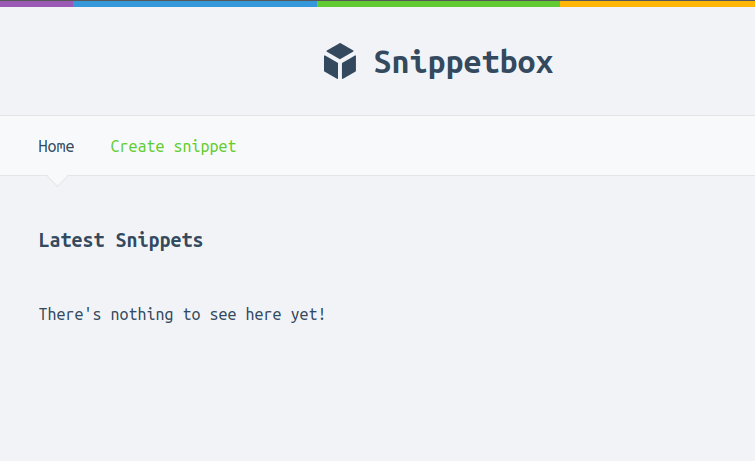
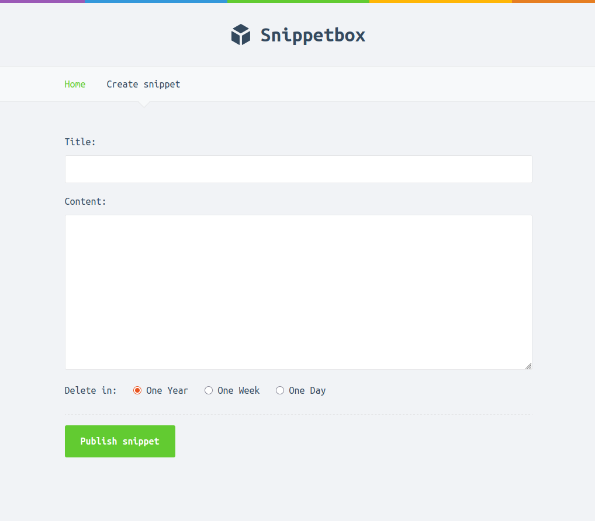
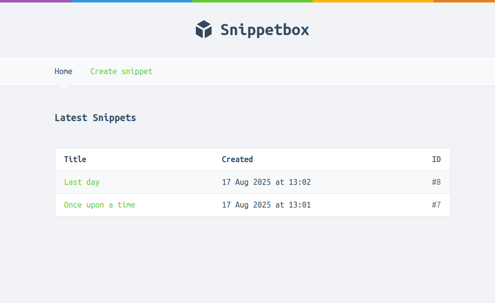

#  SnippetBox  

A simple yet powerful web application for storing and retrieving small text snippets.  
Written entirely in **Go**, SnippetBox provides both a **clean API** and an intuitive **UI** for effortless snippet management.  

---


## ✨ Features  

- 💻 **Pure Go** – Built completely in Go, no external frameworks required.  
- 📜 **Clean API** – Easily create and fetch snippets via RESTful endpoints.  
- 🎨 **Minimal UI** – A simple and user-friendly interface.  
- 📝 **Robust Logging** – Built-in structured logging for easier debugging and monitoring.  

---


## 📷 Preview  
### Home page


### Creating a snippet



### Home page showing the latest snippets



---


## 🚀 Getting Started  

### 1️⃣ Clone the repository  
```bash
git clone https://github.com/EpicCMoment/SnippetBox.git
cd SnippetBox
```

### 2️⃣ Build and run  
```bash
go build -o snippetbox ./cmd/web
./snippetbox
```

### 3️⃣ Access the app  
Open your browser and navigate to:  
```
http://localhost:4000
```
---
